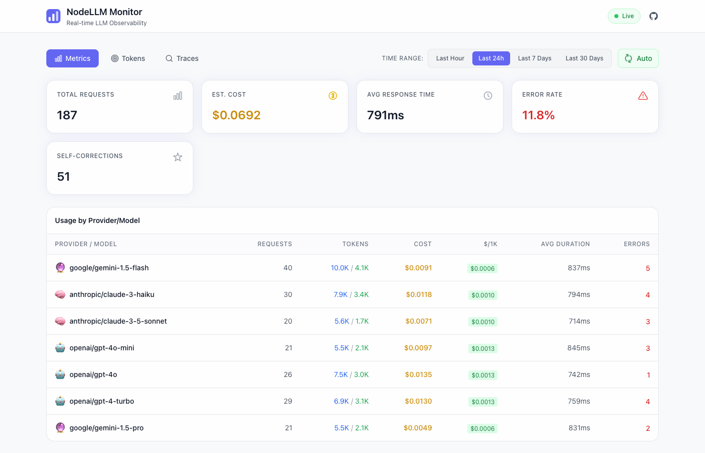
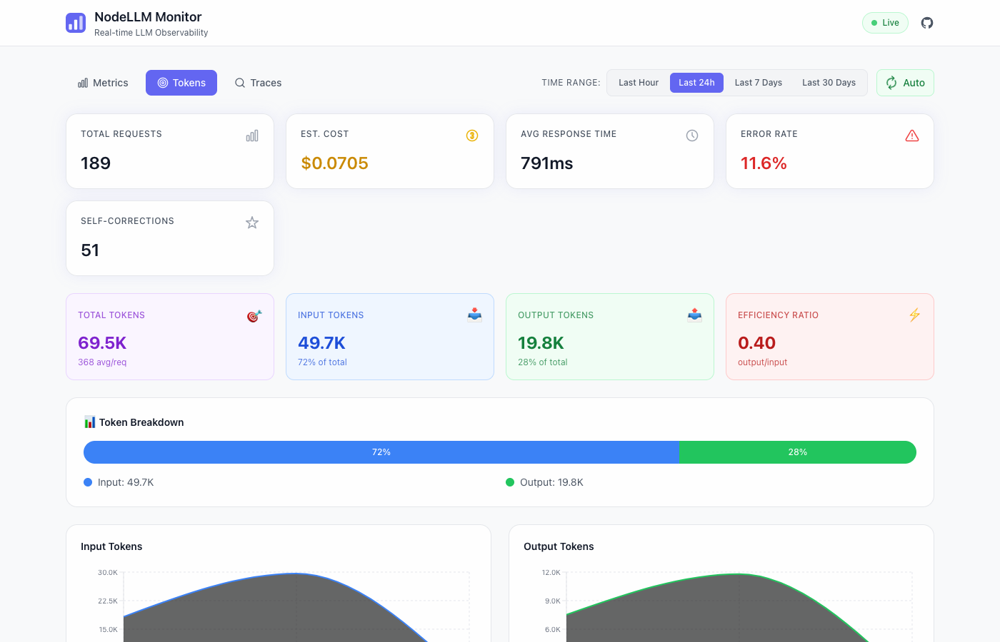
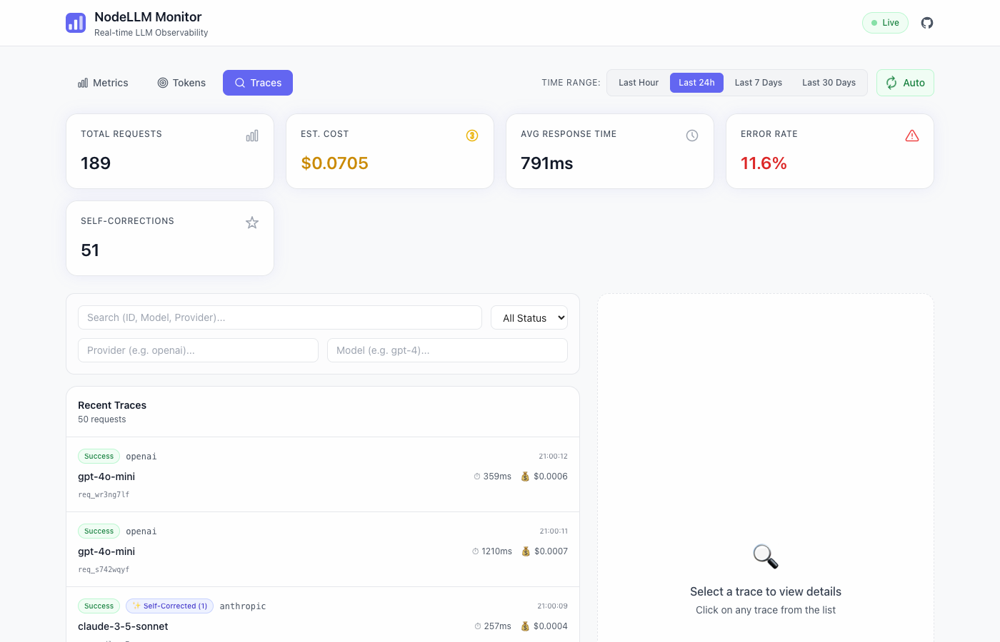

# NodeLLM Monitor 🛰️

[](https://www.npmjs.com/package/@node-llm/monitor)
[](https://www.npmjs.com/package/@node-llm/monitor)
[](https://opensource.org/licenses/MIT)
[](https://www.typescriptlang.org/)

**Production-grade observability for LLM applications in Node.js.**

> _"Datadog for LLMs — built for Node.js"_

NodeLLM Monitor provides infrastructure-first monitoring for AI applications. It captures requests, tool calls, costs, performance metrics, and traces across providers and SDKs — with a standalone real-time dashboard.

---

## ✨ Why NodeLLM Monitor?

Modern AI apps fail silently. You need visibility into:

- **Request latency** — How long are LLM calls taking?
- **Token usage & cost** — What's the actual spend per request?
- **Tool execution** — Which tools are being called, and are they succeeding?
- **Streaming behavior** — What's the time-to-first-token?
- **Error rates** — Which requests are failing and why?
- **Provider reliability** — Is OpenAI slower than Anthropic today?

NodeLLM Monitor gives you deep observability **without vendor lock-in**.

---

## 🎯 Who Is This For?

- **Teams running LLMs in production** — You need visibility, not just logs
- **Node.js backend engineers building AI features** — First-class TypeScript support
- **Platforms needing provider-agnostic telemetry** — Works with any LLM provider
- **Apps using NodeLLM, Vercel AI SDK, LangChain, or OpenTelemetry pipelines**

---

## 🏗️ Architecture

NodeLLM Monitor is designed as a decoupled observability layer:

```
LLM SDK / Framework
        ↓
NodeLLM Middleware OR OpenTelemetry Bridge
        ↓
Monitoring Engine
        ↓
Storage Adapter (Memory / File / Prisma / Custom)
        ↓
Dashboard + API
```

It operates in two primary modes:

1. **Native Middleware**: First-class integration with `@node-llm/core`
2. **OpenTelemetry Bridge**: Zero-code instrumentation for Vercel AI SDK, LangChain, or any OTel-compatible library

---

## 📦 Packages

| Package                                             | Version                                                     | Description                                             |
| --------------------------------------------------- | ----------------------------------------------------------- | ------------------------------------------------------- |
| [`@node-llm/monitor`](./packages/monitor)           |       | Core monitoring engine, storage adapters, and dashboard |
| [`@node-llm/monitor-otel`](./packages/monitor-otel) |  | OpenTelemetry bridge for AI observability               |

## 🚀 Quick Start

### 1. Installation

```bash
pnpm add @node-llm/monitor
```

### 2. Choose your workflow

#### Option A: Native NodeLLM Integration

If you are using `@node-llm/core`, adding monitoring is a single line:

```ts
import { createLLM } from "@node-llm/core";
import { Monitor } from "@node-llm/monitor";

const monitor = Monitor.memory(); // Or File/Prisma adapter

const llm = createLLM({
  provider: "openai",
  model: "gpt-4o",
  middlewares: [monitor]
});

// All calls via 'llm.ask()' are now automatically tracked!
```

#### Option B: OpenTelemetry (Vercel AI SDK, etc.)

Zero-code instrumentation for existing OTel-instrumented libraries:

```ts
import { NodeTracerProvider } from "@opentelemetry/sdk-trace-node";
import { NodeLLMSpanProcessor } from "@node-llm/monitor-otel";
import { Monitor } from "@node-llm/monitor";

const monitor = Monitor.memory();
const provider = new NodeTracerProvider();

// Hook the AI-aware SpanProcessor into your OTel pipeline
provider.addSpanProcessor(new NodeLLMSpanProcessor(monitor.getStore()));
provider.register();
```

### 3. Standalone Observability Dashboard

```ts
import express from "express";
import { Monitor } from "@node-llm/monitor";

const monitor = Monitor.memory();
const app = express();

// Standalone dashboard available at /monitor
app.use(monitor.api({ basePath: "/monitor" }));

app.listen(3000);
```

---

## ✨ Features

### 📊 Real-time Metrics

Track the pulse of your AI infrastructure:

- **Throughput**: Request volume and error rates.
- **Cost**: Automatic token counting and USD cost calculation for major providers.
- **Performance**: Latency tracking, Time-to-First-Token (TTFT), and tokens/sec.





### 🔍 Deep Tracing

Inspect the full lifecycle of every AI request:

- **Tool Calls**: See exactly what tools were called, their arguments, and results.
- **Streaming**: Visualize the progression of streamed responses.
- **Content**: Optional request/response content capture for debugging.



### 🛡️ Privacy & Scrubbing

Production-safe by default:

- **Zero-Storage Content**: Content capture is disabled by default.
- **Automated Scrubbing**: Built-in identifiers for PII (emails, keys, etc.) that mask sensitive data before it hits your database.

### 🔌 Pluggable Storage

| Adapter        | Use Case                                             |
| :------------- | :--------------------------------------------------- |
| **Memory**     | Development and high-speed transient monitoring      |
| **Filesystem** | Persistent JSON logs for low-overhead auditing       |
| **Prisma**     | Production-grade storage (PostgreSQL, SQLite, MySQL) |
| **Custom**     | Build your own (Redis, OpenSearch, etc.)             |

---

## 🌍 Ecosystem Compatibility

NodeLLM Monitor works seamlessly with:

- **[NodeLLM Core](https://nodellm.dev)** — Native middleware integration
- **[Vercel AI SDK](https://sdk.vercel.ai/)** — Via OpenTelemetry bridge
- **[LangChain](https://js.langchain.com/)** — Via OpenTelemetry bridge
- **Any OpenTelemetry instrumented system**

---

## 🛠️ Development

This is a pnpm workspace. To get started:

```bash
# Install dependencies
pnpm install

# Build all packages
pnpm build

# Run the test suite
pnpm test
```

> **Note**: If you encounter `tsx: command not found` when running examples, ensure you've run `pnpm install` at the root to link workspace binaries.

---

## 📖 Examples

We provide detailed examples for various scenarios:

| Example                                               | Description                                      |
| :---------------------------------------------------- | :----------------------------------------------- |
| [`demo`](./examples/demo)                             | Full demo with simulated real-world AI traffic   |
| [`otel-vercel-ai-sdk`](./examples/otel-vercel-ai-sdk) | Integration with Vercel AI SDK via OpenTelemetry |
| [`vercel-ai-sdk`](./examples/vercel-ai-sdk)           | Manual instrumentation for Vercel AI SDK         |
| [`custom-adapter`](./examples/custom-adapter)         | How to implement your own `MonitoringStore`      |

---

## 🤝 Contributing

Contributions welcome! Please read:

- [CONTRIBUTING.md](./CONTRIBUTING.md)
- [CODE_OF_CONDUCT.md](./CODE_OF_CONDUCT.md)

---

## 🔐 Security

Please report vulnerabilities responsibly via [SECURITY.md](./SECURITY.md).

---

## 📜 License

MIT © [Shaiju Edakulangara](https://eshaiju.com)

---

<p align="center">
  <strong>Built with ❤️ for the Node.js AI community</strong>
</p>
